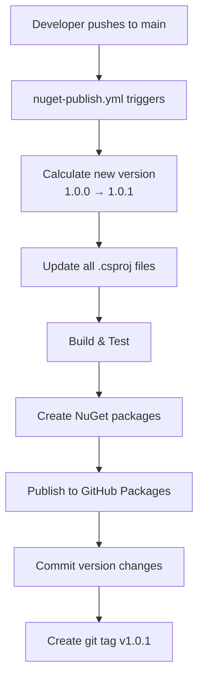
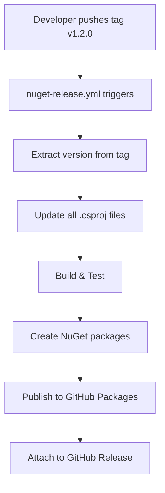

# GitHub Packages (NuGet) Implementation Summary

## Overview

This document summarizes the implementation of automated NuGet package publishing for the HighSpeedDAL project using GitHub Packages.

## What Was Implemented

### 1. NuGet Package Configuration

All major library projects have been configured as NuGet packages with complete metadata:

#### Projects Configured:
- **HighSpeedDAL.Core** - Core abstractions, attributes, and base classes
- **HighSpeedDAL.SourceGenerators** - Roslyn source generators (includes Humanizer dependency)
- **HighSpeedDAL.SqlServer** - SQL Server provider implementation
- **HighSpeedDAL.Sqlite** - SQLite provider implementation
- **HighSpeedDAL.DataManagement** - Data archival, versioning, CDC features
- **HighSpeedDAL.AdvancedCaching** - Advanced caching strategies

#### Package Metadata Added:
Each `.csproj` file now includes:
```xml
<PropertyGroup>
  <PackageId>HighSpeedDAL.[ProjectName]</PackageId>
  <Version>1.0.0</Version>
  <Authors>rhale78</Authors>
  <Company>HighSpeedDAL</Company>
  <Description>[Project-specific description]</Description>
  <PackageTags>dal;orm;database;...</PackageTags>
  <PackageProjectUrl>https://github.com/rhale78/HighSpeedDAL</PackageProjectUrl>
  <RepositoryUrl>https://github.com/rhale78/HighSpeedDAL</RepositoryUrl>
  <RepositoryType>git</RepositoryType>
  <PackageLicenseExpression>MIT</PackageLicenseExpression>
  <PackageReadmeFile>README.md</PackageReadmeFile>
  <IncludeSymbols>true</IncludeSymbols>
  <SymbolPackageFormat>snupkg</SymbolPackageFormat>
</PropertyGroup>
```

### 2. GitHub Actions Workflows

#### Workflow 1: nuget-publish.yml (Automatic Publishing)
**Triggers:** Push to main branch (when src/** changes)

**Process:**
1. Calculates new version by incrementing build number
2. Updates all `.csproj` files with new version
3. Restores dependencies
4. Builds solution in Release configuration
5. Runs tests
6. Creates NuGet packages (.nupkg and .snupkg)
7. Publishes packages to GitHub Packages
8. Commits version changes back to repository with `[skip ci]` tag
9. Creates git tag (e.g., v1.0.1)

**Manual Trigger:** Workflow dispatch with version bump options (build/minor/major)

#### Workflow 2: nuget-release.yml (Tagged Releases)
**Triggers:** Push of version tags (v*.*.*)

**Process:**
1. Extracts version from tag
2. Updates all `.csproj` files
3. Builds and tests solution
4. Creates and publishes NuGet packages
5. Attaches packages to GitHub release (if applicable)

### 3. Versioning Strategy

**Format:** `major.minor.build` (Semantic Versioning)

- **Major (X.0.0)**: Breaking changes - manual increment via workflow dispatch or tag
- **Minor (0.X.0)**: New features (backward compatible) - manual increment via workflow dispatch or tag
- **Build (0.0.X)**: Bug fixes and patches - auto-incremented on each commit to main

**Version Synchronization:**
All packages share the same version number. When one is updated, all are updated together.

**Initial Version:** 1.0.0

### 4. Documentation

#### GITHUB_PACKAGES.md
Complete guide for package consumers including:
- Prerequisites and setup
- Creating Personal Access Tokens
- Configuring NuGet sources
- Installing packages
- Package reference table
- Troubleshooting
- CI/CD integration examples

#### NUGET_MAINTENANCE.md
Comprehensive maintenance guide for project maintainers including:
- Package structure overview
- Versioning strategy
- Publishing workflows (automatic and manual)
- Updating package metadata
- Version synchronization
- Troubleshooting
- Best practices
- Local testing instructions

#### README.md Updates
- Added NuGet packages section with package table
- Added quick installation instructions
- Added link to GITHUB_PACKAGES.md
- Added package versioning section
- Updated status to include NuGet package automation

### 5. Package Features

Each package includes:
- ✅ Complete metadata (description, authors, tags, license, etc.)
- ✅ README.md documentation file
- ✅ Symbol packages (.snupkg) for debugging support
- ✅ Proper dependency declarations
- ✅ Source link configuration (for GitHub integration)

### 6. Special Considerations

#### SourceGenerators Package
The SourceGenerators package required special handling:
- Configured as `IsRoslynComponent=true`
- Set `IncludeBuildOutput=false`
- Manually includes the generator DLL and Humanizer.dll in `analyzers/dotnet/cs` path
- Marked as `DevelopmentDependency=true`

### 7. Testing Results

All packages have been successfully tested locally:
```
✓ HighSpeedDAL.Core.1.0.0.nupkg
✓ HighSpeedDAL.Core.1.0.0.snupkg
✓ HighSpeedDAL.SourceGenerators.1.0.0.nupkg
✓ HighSpeedDAL.SqlServer.1.0.0.nupkg
✓ HighSpeedDAL.SqlServer.1.0.0.snupkg
✓ HighSpeedDAL.Sqlite.1.0.0.nupkg
✓ HighSpeedDAL.Sqlite.1.0.0.snupkg
✓ HighSpeedDAL.DataManagement.1.0.0.nupkg
✓ HighSpeedDAL.DataManagement.1.0.0.snupkg
✓ HighSpeedDAL.AdvancedCaching.1.0.0.nupkg
✓ HighSpeedDAL.AdvancedCaching.1.0.0.snupkg
```

## How It Works

### Automatic Publishing on Commit



### Tagged Release



## Usage Examples

### For Package Consumers

1. **Configure GitHub Packages authentication:**
```bash
dotnet nuget add source https://nuget.pkg.github.com/rhale78/index.json \
  --name github \
  --username YOUR_GITHUB_USERNAME \
  --password YOUR_GITHUB_PAT \
  --store-password-in-clear-text
```

2. **Install packages:**
```bash
dotnet add package HighSpeedDAL.Core
dotnet add package HighSpeedDAL.SqlServer
dotnet add package HighSpeedDAL.SourceGenerators
```

### For Maintainers

1. **Automatic patch release (build increment):**
   - Simply commit and push to main
   - Version automatically increments: 1.0.0 → 1.0.1

2. **Minor version release:**
   - Go to Actions → Publish NuGet Packages → Run workflow
   - Select "minor" for version bump
   - Version increments: 1.0.1 → 1.1.0

3. **Major version release:**
   - Create and push a tag: `git tag v2.0.0 && git push origin v2.0.0`
   - Or use workflow dispatch with "major" option
   - Version increments: 1.1.0 → 2.0.0

## Files Modified/Created

### Modified Files:
- `src/HighSpeedDAL.Core/HighSpeedDAL.Core.csproj`
- `src/HighSpeedDAL.SourceGenerators/HighSpeedDAL.SourceGenerators.csproj`
- `src/HighSpeedDAL.SqlServer/HighSpeedDAL.SqlServer.csproj`
- `src/HighSpeedDAL.Sqlite/HighSpeedDAL.Sqlite.csproj`
- `src/HighSpeedDAL.DataManagement/HighSpeedDAL.DataManagement.csproj`
- `src/HighSpeedDAL.AdvancedCaching/HighSpeedDAL.AdvancedCaching.csproj`
- `README.md`

### New Files:
- `.github/workflows/nuget-publish.yml`
- `.github/workflows/nuget-release.yml`
- `GITHUB_PACKAGES.md`
- `NUGET_MAINTENANCE.md`

## Benefits

1. **Automated Publishing**: No manual steps required for publishing packages
2. **Version Control**: Automatic version management with semantic versioning
3. **Consistency**: All packages updated together with synchronized versions
4. **Traceability**: Git tags for every release
5. **Debugging Support**: Symbol packages for better debugging experience
6. **Documentation**: Comprehensive guides for both users and maintainers
7. **CI/CD Integration**: Seamless integration with GitHub Actions
8. **Private Distribution**: Packages hosted on GitHub Packages (can be public or private)

## Next Steps for Users

After this PR is merged to main:

1. The first automatic build will publish version 1.0.1
2. Packages will be available at: https://github.com/rhale78?tab=packages&repo_name=HighSpeedDAL
3. Users can start consuming packages by following GITHUB_PACKAGES.md
4. Maintainers can refer to NUGET_MAINTENANCE.md for ongoing management

## Security Considerations

- ✅ Uses GITHUB_TOKEN (automatically provided, no secrets to manage)
- ✅ Write permissions configured for contents and packages
- ✅ Package authentication required for private packages
- ✅ Version commits tagged with `[skip ci]` to prevent infinite loops
- ✅ All packages include LICENSE file (MIT)

## Validation

All workflows have been validated:
- ✅ YAML syntax is correct
- ✅ PowerShell scripts are valid
- ✅ Local package creation tested successfully
- ✅ All packages include required files and metadata
- ✅ Documentation reviewed and complete

## Support

For issues or questions:
- **Package Installation**: See GITHUB_PACKAGES.md
- **Package Maintenance**: See NUGET_MAINTENANCE.md
- **Bug Reports**: Open an issue on GitHub
- **Feature Requests**: Open an issue with "enhancement" label
