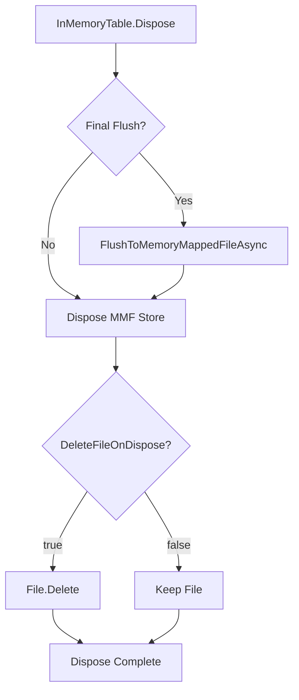

# Memory-Mapped File Cleanup Guide

## Overview

Memory-mapped files (`.mmf`) created by HighSpeedDAL are stored in `%TEMP%\HighSpeedDAL\` on Windows and persist by default. This is intentional to support cross-process scenarios and application restarts. However, for test scenarios and development, you'll want to clean up these files.

## Cleanup Options

### Option 1: Automatic Cleanup on Dispose (Recommended for Tests)

Use the `DeleteFileOnDispose` property in `InMemoryTableAttribute`:

```csharp
[InMemoryTable(
    MemoryMappedFileName = "TestUsers",
    MemoryMappedFileSizeMB = 50,
    AutoCreateFile = true,
    AutoLoadOnStartup = true,
    DeleteFileOnDispose = true)]  // ? File deleted when table disposed
public class User
{
    public int Id { get; set; }
    public string Name { get; set; }
    public string Email { get; set; }
}
```

**When to use:**
- ? Unit tests / integration tests
- ? Development scenarios
- ? Temporary data that doesn't need persistence
- ? Production scenarios requiring cross-process coordination
- ? Data that should survive application restarts

### Option 2: Manual Cleanup via API

Use the `DeleteMemoryMappedFile()` method:

```csharp
var table = new InMemoryTable<User>(config, logger);

// ... use the table ...

// Manually delete the file when done
table.DeleteMemoryMappedFile();
table.Dispose();
```

**When to use:**
- ? Conditional cleanup logic
- ? Cleanup after specific operations complete
- ? Fine-grained control over file lifecycle
- ? When `DeleteFileOnDispose` is too aggressive

### Option 3: Test Suite Cleanup (Batch Cleanup)

The `MemoryMappedTestSuite` automatically cleans up files from the current test run:

```csharp
public async Task RunAllTestsAsync()
{
    // ... run all test parts ...
    
    // Automatic cleanup at the end
    await CleanupTestFilesAsync();
}
```

This deletes all `.mmf` files with the current run's timestamp.

**How it works:**
1. Each test run has a unique timestamp: `_runTimestamp = DateTime.Now.ToString("yyyyMMdd_HHmmss")`
2. Files are named: `{TestName}_{timestamp}.mmf`
3. Cleanup searches for: `*{_runTimestamp}.mmf`
4. Only files from the current run are deleted (safe for concurrent test runs)

### Option 4: Manual File Deletion

If files accumulate, you can manually delete them:

**Windows:**
```cmd
del %TEMP%\HighSpeedDAL\*.mmf
```

**PowerShell:**
```powershell
Remove-Item "$env:TEMP\HighSpeedDAL\*.mmf" -Force
```

**Linux/macOS:**
```bash
rm /tmp/HighSpeedDAL/*.mmf
```

## Default Behavior

| Scenario | DeleteFileOnDispose Default | Recommended |
|----------|---------------------------|-------------|
| Production | `false` (preserve file) | `false` |
| Development | `false` (preserve file) | `true` |
| Unit Tests | `false` (preserve file) | `true` |
| Integration Tests | `false` (preserve file) | `true` |
| Cross-Process IPC | `false` (preserve file) | `false` |

## File Persistence Strategy

### Why Files Persist by Default

Memory-mapped files are designed for:
1. **Cross-process coordination** - Multiple processes share the same file
2. **Application restarts** - Data survives process crashes/restarts
3. **Hot reload scenarios** - Data preserved during development iterations

### When to Keep Files

- ? Multi-process applications sharing data
- ? Services that restart frequently
- ? Data that should survive crashes
- ? Queue implementations across processes

### When to Delete Files

- ? Test scenarios (unit/integration tests)
- ? Development/debugging (avoid clutter)
- ? One-time data processing jobs
- ? Temporary caching scenarios

## Best Practices

### For Production Code

```csharp
[InMemoryTable(
    MemoryMappedFileName = "ProductionQueue",
    MemoryMappedFileSizeMB = 500,
    AutoCreateFile = true,
    AutoLoadOnStartup = true,
    DeleteFileOnDispose = false)]  // Keep for persistence
public class QueueItem { }
```

### For Test Code

```csharp
[InMemoryTable(
    MemoryMappedFileName = "TestQueue",
    MemoryMappedFileSizeMB = 50,
    AutoCreateFile = true,
    AutoLoadOnStartup = false,  // Start fresh
    DeleteFileOnDispose = true)]  // Cleanup after test
public class TestQueueItem { }
```

### For Conditional Cleanup

```csharp
var table = new InMemoryTable<User>(config, logger);

try
{
    // ... use the table ...
}
finally
{
    // Cleanup on error but keep on success
    if (errorOccurred)
    {
        table.DeleteMemoryMappedFile();
    }
    table.Dispose();
}
```

## Troubleshooting

### "Access Denied" When Deleting File

**Cause:** Another process still has the file open.

**Solutions:**
1. Ensure all `InMemoryTable` instances are disposed
2. Wait a moment for file handles to release
3. Check for zombie processes in Task Manager
4. Restart your application/tests

### Files Accumulating Over Time

**Cause:** `DeleteFileOnDispose = false` in test scenarios.

**Solutions:**
1. Set `DeleteFileOnDispose = true` for tests
2. Add cleanup to test teardown methods
3. Use timestamp-based naming for uniqueness
4. Add scheduled cleanup task for old files

### File Not Found After Restart

**Expected behavior:** If `DeleteFileOnDispose = true`, files are deleted.

**Solutions:**
1. Set `DeleteFileOnDispose = false` for persistence
2. Use `AutoLoadOnStartup = true` to reload data
3. Check `%TEMP%\HighSpeedDAL\` for file existence

## Implementation Details

### File Storage Location

```
Windows: %TEMP%\HighSpeedDAL\{FileName}.mmf
Linux:   /tmp/HighSpeedDAL/{FileName}.mmf
macOS:   /tmp/HighSpeedDAL/{FileName}.mmf
```

### Disposal Flow



### Cleanup Flow in Test Suite

```mermaid
graph TD
    A[RunAllTestsAsync] --> B[Part 1: CRUD]
    B --> C[Part 2: Direct MMF]
    C --> D[Part 3: Benchmarks]
    D --> E[Part 4: Concurrent Access]
    E --> F[Part 5: Stress Tests]
    F --> G[CleanupTestFilesAsync]
    G --> H{Find Files}
    H -->|Match *{timestamp}.mmf| I[Delete Each File]
    I --> J[Report Results]
```

## API Reference

### InMemoryTableAttribute Properties

```csharp
public sealed class InMemoryTableAttribute : Attribute
{
    /// <summary>
    /// When true, deletes the memory-mapped file when disposed.
    /// Default: false (preserve for persistence)
    /// </summary>
    public bool DeleteFileOnDispose { get; set; } = false;
}
```

### InMemoryTable Methods

```csharp
public class InMemoryTable<TEntity> : IDisposable where TEntity : class
{
    /// <summary>
    /// Deletes the memory-mapped file from disk.
    /// Warning: Permanently deletes the file.
    /// </summary>
    public void DeleteMemoryMappedFile();
}
```

### MemoryMappedFileStore Methods

```csharp
public sealed class MemoryMappedFileStore<T> : IDisposable where T : class
{
    /// <summary>
    /// Deletes the memory-mapped file from disk.
    /// Warning: Permanently deletes the file.
    /// </summary>
    public void DeleteFile();
}
```

## Examples

### Example 1: Test with Auto-Cleanup

```csharp
[Fact]
public async Task TestWithAutoCleanup()
{
    var config = new InMemoryTableAttribute
    {
        MemoryMappedFileName = "TestData",
        DeleteFileOnDispose = true  // Auto-cleanup
    };
    
    using var table = new InMemoryTable<User>(config, logger);
    
    await table.InsertAsync(new User { Id = 1, Name = "Test" });
    
    // File automatically deleted when table disposed
}
```

### Example 2: Manual Cleanup After Operation

```csharp
var table = new InMemoryTable<User>(config, logger);

await ProcessDataAsync(table);

// Explicitly delete file
table.DeleteMemoryMappedFile();
table.Dispose();
```

### Example 3: Conditional Cleanup in Test Suite

```csharp
public async Task RunTestWithCleanup()
{
    string timestamp = DateTime.Now.ToString("yyyyMMdd_HHmmss");
    
    try
    {
        // Create table with timestamp-based filename
        var config = new InMemoryTableAttribute
        {
            MemoryMappedFileName = $"Test_{timestamp}",
            DeleteFileOnDispose = false  // Manual control
        };
        
        using var table = new InMemoryTable<User>(config, logger);
        
        // ... run tests ...
    }
    finally
    {
        // Cleanup all files from this run
        var files = Directory.GetFiles(
            Path.Combine(Path.GetTempPath(), "HighSpeedDAL"),
            $"*{timestamp}.mmf");
            
        foreach (var file in files)
        {
            File.Delete(file);
        }
    }
}
```

## Related Documentation

- [Memory-Mapped File Implementation](MEMORY_MAPPED_FILE_IMPLEMENTATION.md)
- [Memory-Mapped File Quickstart](MEMORY_MAPPED_FILE_QUICKSTART.md)
- [Memory-Mapped Test Suite](MEMORY_MAPPED_TEST_SUITE_SUMMARY.md)

---

**HighSpeedDAL Framework** - Memory-Mapped File Cleanup Guide  
Version: 0.1 | Last Updated: 2025-01-09
